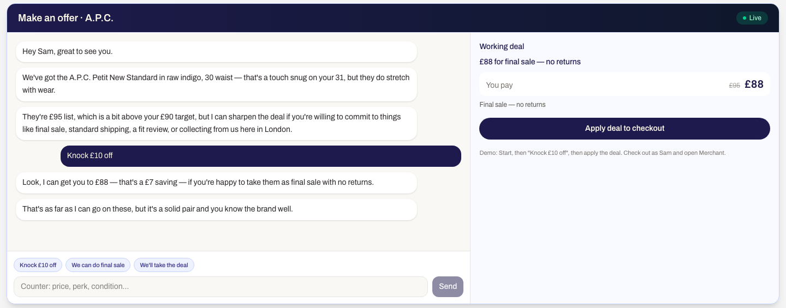
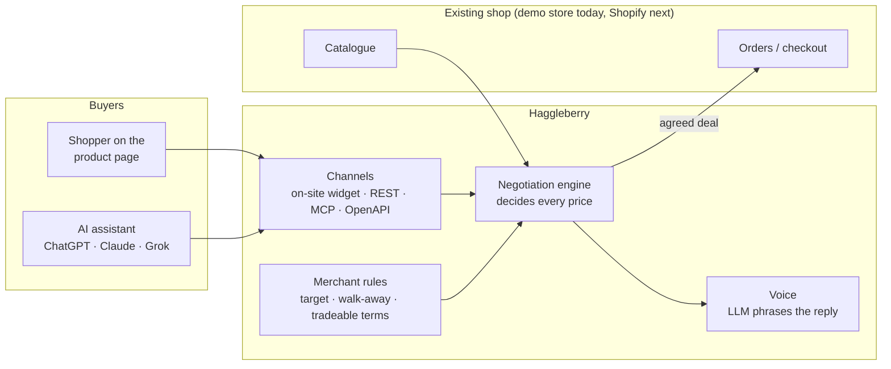
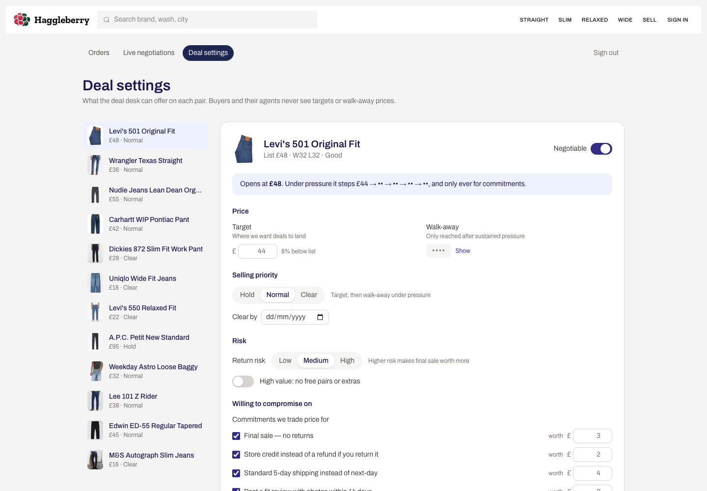
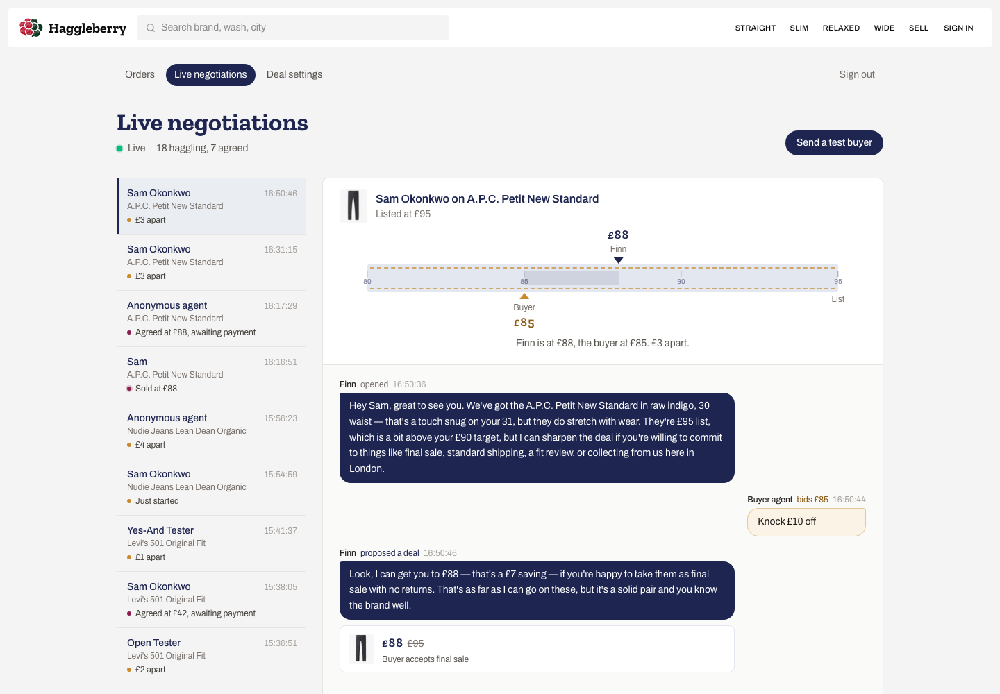
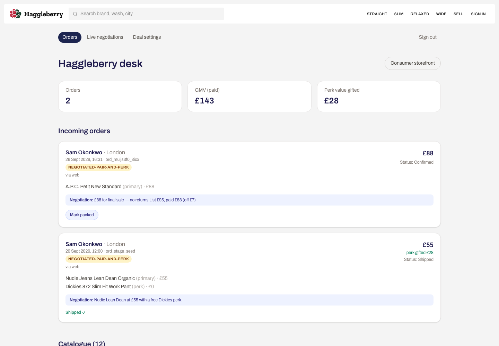
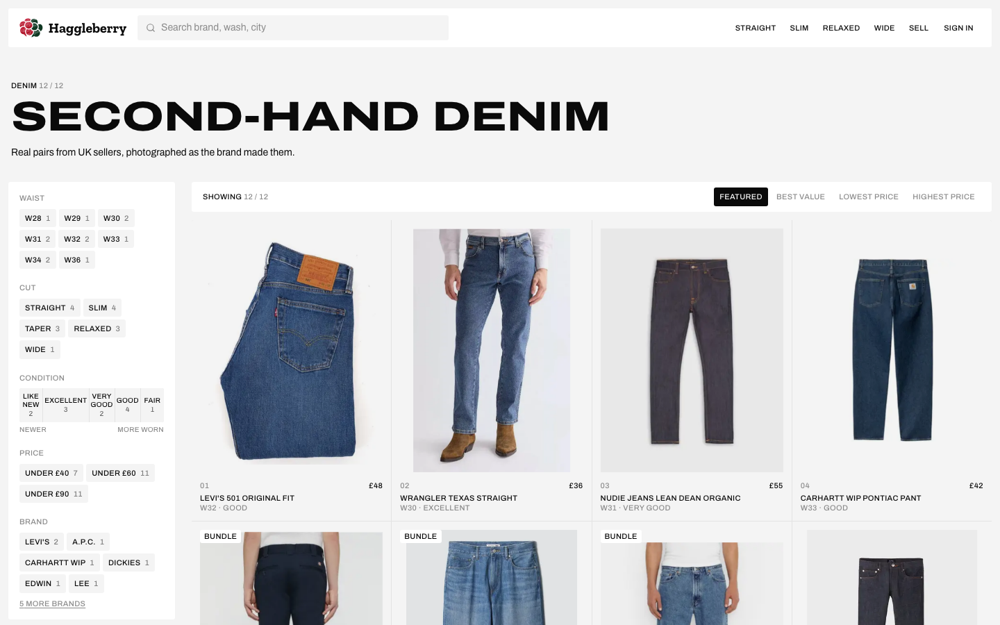

# Haggleberry

**The negotiator Mark Twain would've been proud of.**

Haggleberry gives any online shop a haggler called **Finn**. Shoppers, or the AI assistants shopping for them (ChatGPT, Claude, Grok), can make an offer on anything. Finn negotiates inside rules the merchant sets, then books the order at the agreed price.

**This is not a denim store.** The second-hand denim shop in this repo is a demo storefront, there so you can see Finn at work. The product is the negotiation layer. It is meant to sit on top of an existing shop, such as a Shopify store, without rebuilding that shop's catalogue or checkout.

Live demo: **https://indigo-lane.vercel.app** · [Writeup](docs/hackathon/writeup.md) · [End card](https://indigo-lane.vercel.app/pitch) · [Demo script](docs/hackathon/demo-script.md) · Track: Agentic Commerce



## The idea: enterprise pricing for everyone

Big buyers have always traded terms for price: longer contracts, no returns, slower delivery. Haggleberry brings that to a single basket. Finn gives **deals, not discounts**. Price moves only when the buyer gives something back:

| The buyer commits to… | …and gets |
| --- | --- |
| Final sale, no returns | A lower price |
| Store credit instead of a refund | A lower price |
| Standard shipping instead of next-day | A lower price |
| A fit review with photos | A lower price |
| Paying full price | A free second item (Pair & Perk) or free hemming |

The merchant decides what each commitment is worth to them. Finn never goes below the walk-away price, and buyers and their agents never see it.

## How it plugs into a shop



Haggleberry needs three things from a shop, and each lives behind one module:

| Seam | What it does | In this repo | With Shopify |
| --- | --- | --- | --- |
| Catalogue in | Products, list prices, stock | [`src/lib/products.ts`](src/lib/products.ts) (seed catalogue) | Storefront / Admin API products |
| Merchant rules | Target and walk-away price per item, which terms can be traded and what each is worth | [`src/lib/negotiation/policies.ts`](src/lib/negotiation/policies.ts), edited at `/merchant/deals` | Same, stored per shop |
| Orders out | Book the order at the agreed price | [`src/lib/store.ts`](src/lib/store.ts) (Supabase, or a local file) | Draft order or discount code at checkout |

The Shopify app is not built yet. The seams above are where it will connect. Everything else (the engine, Finn's voice, the agent APIs, the merchant desk) is store-agnostic already.

## What the merchant sees

**Deal settings**: per-item target and walk-away price, selling priority (hold / normal / clear), return risk, and which commitments Finn may trade and for how much.



**Live negotiations**: every haggle as it happens, humans and agents alike, with a price tape showing how far apart Finn and the buyer are.



**Orders**: each order records the channel (`web` or `agent`) and the deal that closed it.



## What the shopper sees

The demo storefront starts anonymous, like a logged-out Vinted visit. Fit, budget and past buys only show up once the shopper signs in, arrives from an ad, or sends their own agent.



| Source | How | What Finn knows |
| --- | --- | --- |
| Anonymous | open `/` | Nothing. Offers on price and perk only. |
| Ad | `/?utm_campaign=raw-denim`, then open a product | Campaign intent. No personal data. |
| Login | `/login` → Continue as demo shopper | Sam's size (W31), £90 budget, an abandoned A.P.C. |
| Agent | `Authorization: Bearer il_demo_agent_token` | Same as login, over REST or MCP |
| One-time link | Account → Give your agent a sign-in link | Size, budget and past buys. The password stays with the shopper and the link works once. |

## Why the LLM can't give away the shop

- **The engine decides every number.** [`engine.ts`](src/lib/negotiation/engine.ts) is deterministic. It opens at the merchant's target and moves toward the walk-away price in shrinking steps, and only for commitments.
- **The LLM only writes the words.** [`voice.ts`](src/lib/negotiation/voice.ts) turns the engine's decision into Finn's reply, via Vercel AI Gateway (`AI_GATEWAY_API_KEY`) or the Claude API (`ANTHROPIC_API_KEY`). It never sees the floor. If a reply mentions a £ amount or percentage the engine didn't produce, a template replaces it. With no key set, templates are used throughout.
- **Only structured fields bind.** Prices travel in `counterOffer` / `acceptOfferId`, never parsed from chat. Purchase checks the price against the server's agreed deal.

The on-site widget, `/api/v1`, `/api/negotiations` and the MCP tools all run on this one engine.

## Try it

### Demo accounts

These are safe, shared demo credentials, not secrets.

| | |
| --- | --- |
| Shopper email | `sam.okonkwo@example.com` |
| Shopper password | `indigo-demo` |
| Agent bearer token | `il_demo_agent_token` |
| Merchant desk password | `indigo-merchant` (at `/merchant/login`) |

### Click path (about a minute)

1. Open `/`: a generic shop with no personalisation.
2. Sign in → **Continue as demo shopper**.
3. Open `/product/apc-petit-new` → **Make an offer** → **Start offer**. Finn opens knowing Sam wears W31 (this pair is W30) and that £95 is £5 over budget.
4. Send "Knock £10 off". Finn answers with a deal, not a discount: e.g. £88 for final sale.
5. **We'll take the deal** → **Apply deal to checkout** → Confirm.
6. Sign in at `/merchant/login` and watch it land on `/merchant` and `/merchant/live`.

### As an agent

```bash
# Start a negotiation
curl -s -X POST https://indigo-lane.vercel.app/api/v1/negotiations \
  -H 'authorization: Bearer il_demo_agent_token' \
  -H 'content-type: application/json' \
  -d '{"productId":"apc-petit-new"}'

# Counter (use negotiationId from the response)
curl -s -X POST https://indigo-lane.vercel.app/api/v1/negotiations/NEG_ID/messages \
  -H 'authorization: Bearer il_demo_agent_token' \
  -H 'content-type: application/json' \
  -d '{"message":"Knock £10 off"}'
```

| Surface | Where |
| --- | --- |
| REST (v1) | `/api/v1/products`, `/api/v1/negotiations`, `/api/v1/orders` |
| OpenAPI | `/openapi.json` (v1) and `/api/openapi.json` (ChatGPT Actions) |
| MCP | `/api/mcp` and `/mcp/http` (`negotiate`, `place_order`, …) |
| Agent guide | `/llms.txt` |
| Markdown pages | send `Accept: text/markdown` to `/` or `/product/{id}` |

**ChatGPT:** create a GPT → Actions → Import from URL → `https://indigo-lane.vercel.app/api/openapi.json` (auth: none). Purchase is marked `x-openai-isConsequential`, so ChatGPT asks before buying.

Full reference: [docs/negotiation-api.md](docs/negotiation-api.md).

## Run locally

```bash
pnpm install
pnpm run dev      # http://localhost:3000
pnpm run build
```

Next.js App Router, TypeScript, Tailwind v4, pnpm. **No environment variables are needed for the demo**: without them it uses the seed catalogue, a local order file and template replies. Copy [`.env.example`](.env.example) to `.env.local` to add:

- Supabase (`NEXT_PUBLIC_SUPABASE_URL`, `NEXT_PUBLIC_SUPABASE_PUBLISHABLE_KEY`, `SUPABASE_SERVICE_ROLE_KEY`) for persistent orders, merchant rules and live negotiations. See [supabase/README.md](supabase/README.md).
- `AI_GATEWAY_API_KEY` or `ANTHROPIC_API_KEY` for LLM-written replies.
- `MERCHANT_PASSWORD` to replace the demo merchant password.

## Repo map

| Path | What's there |
| --- | --- |
| [`src/lib/negotiation/`](src/lib/negotiation/) | The product: engine, voice, merchant policies, sessions, connector compatibility |
| [`src/app/merchant/`](src/app/merchant/) | Merchant desk: orders, live negotiations, deal settings |
| [`src/app/api/`](src/app/api/) | REST, MCP, OpenAPI and merchant APIs |
| [`src/app/`](src/app/) (`/`, `/product`, `/checkout`) | The demo storefront |
| [`src/lib/products.ts`](src/lib/products.ts), [`src/lib/store.ts`](src/lib/store.ts) | Catalogue and order seams (where a Shopify adapter plugs in) |
| [`supabase/`](supabase/) | Migrations and seed data |
| [`docs/`](docs/) | API reference, design notes, hackathon checklist, screenshots |

## Hackathon notes

Built for Grok Bot Commerce x Fleek London. Before the pitch, say **final checklist** and the agent runs [docs/hackathon/final-checklist.md](docs/hackathon/final-checklist.md): live URL, writeup, `/pitch` with QR codes, and a demo recording.
